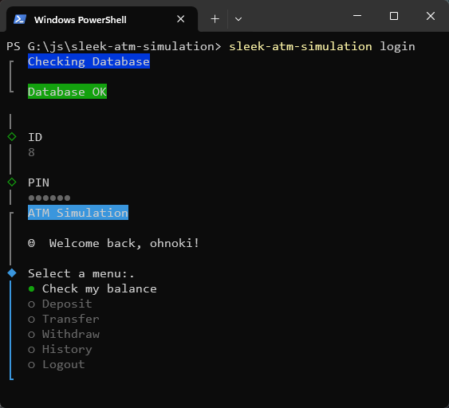
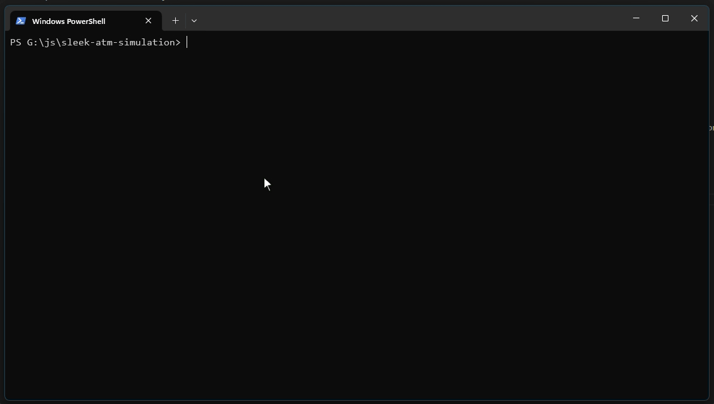

# Sleek ATM Simulation

A MYSQL powered ATM Simulation system with features:

-   User registration and login
-   Transfer
-   User account management (view balance, deposit, withdraw)
-   Transaction history

### CLI Commands:

-   `register`: registering an account.
-   `login`: login to an account.
-   `db-tables-setup`: setup mysql database required tables. database credential must be (user: root, pass: '', port: 3306, dbname: atm_simulation)
-   `configure-db`: Configure the database connection information. The config file should be at $HOME/.sleek-atm-simulation/config.json

## Preview

